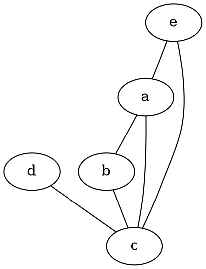
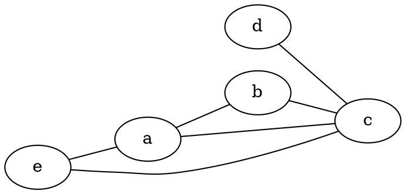
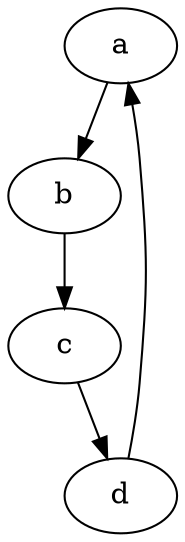
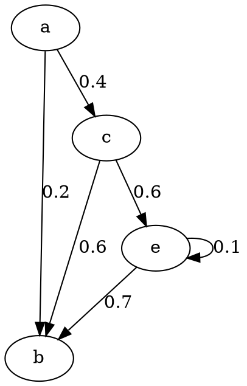
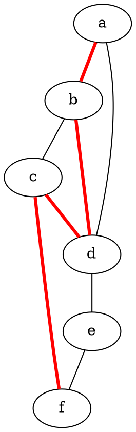
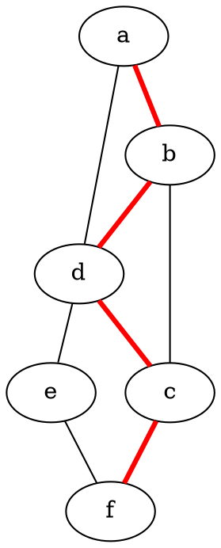
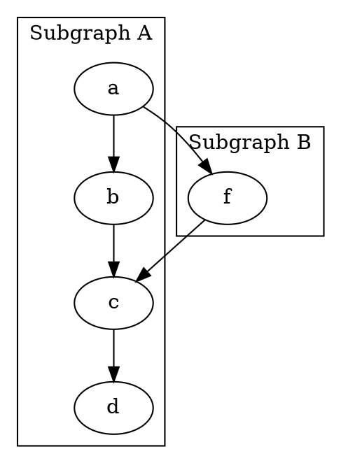
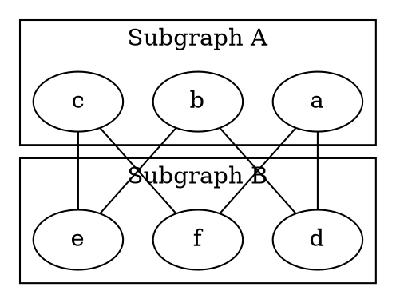
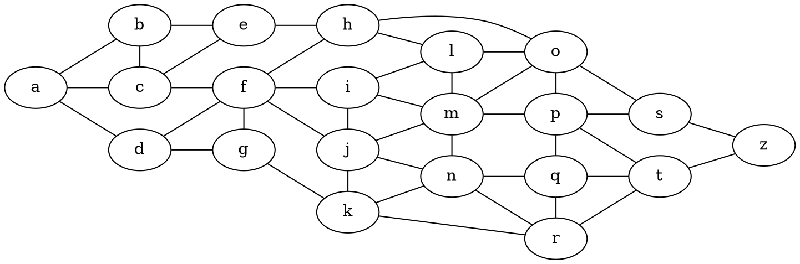

---
markdown:
  image_dir: /assets/graphviz
  path: /tools/graph-tool/graphviz/markdown-graph.md
  absolute_image_path: true
---

## plantuml

```puml {filename="graphviz-markdown-plantuml.png"}
@startuml
A -> B
@enduml
```

## graphviz

### Simple Graph

### Graph Direction

### Simple Digraph (有向图)

### Full Digraph

### Style Path

#### shorthand of styling path

### Subgraph

#### seperate nodes and edges expression of subgraph

### Big Graph Tricks

- 通过{}能用一个语句组织图的多个边
- 通过`rank`来组织节点的层级结构

