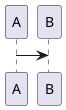

---
markdown:
  image_dir: /assets/graphviz
  path: /tools/graph-tool/graphviz/markdown-graph.md
  absolute_image_path: true
---

## plantuml

```puml {filename="graphviz-markdown-plantuml.png"}
@startuml
A -> B
@enduml
```
